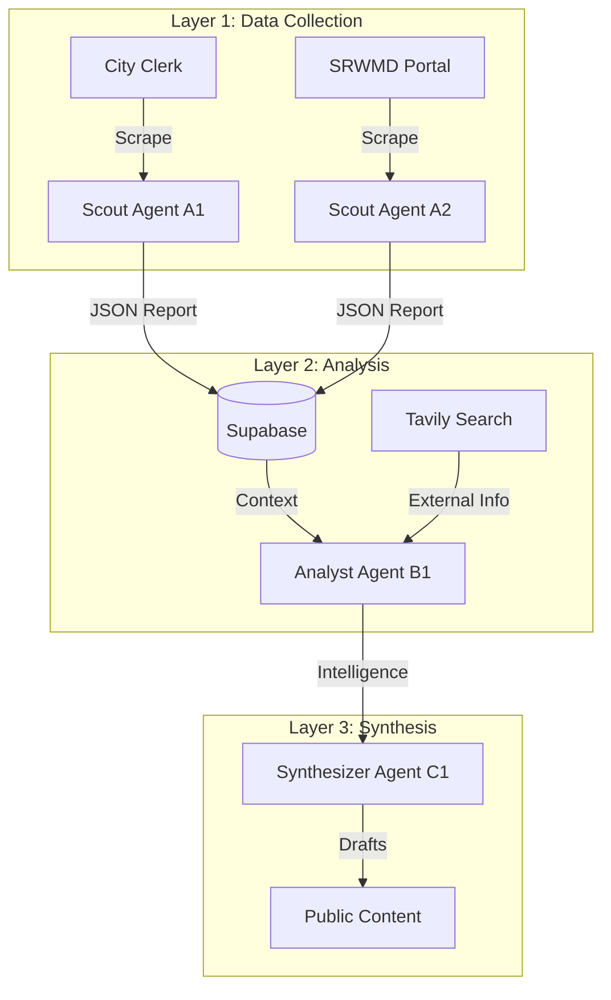

# Alachua Civic Intelligence Platform: Project Knowledge Base

**Purpose:** Comprehensive context for the Automated Civic Intelligence System  
**Date:** January 28, 2026 (Refactored for Automation)  
**Project Lead:** Hans  

---

## 1. Executive Vision

We are building a **near-realtime AI-powered civic intelligence platform** that automatically monitors the health and transparency of democratic institutions. It serves as a "nervous system" for democracy, detecting threats to environmental protection (specifically the **Santa Fe River Basin**) and enabling rapid, informed citizen response.

### Why It Matters

Individual citizens can't possibly monitor all government activities manually. Meetings happen during work hours. Agendas are posted last-minute. Permits are filed with little notice. Code changes are buried in technical language. Relationships between developers and officials are opaque.

**The result:** Citizens are systematically excluded from meaningful participation, and special interests exploit this information asymmetry.

**Our solution:** Systematic AI monitoring that levels the playing field, making government activity transparent and enabling effective advocacy.

### Core Insight

"Understanding systems is the path to freedom." - Hans's Zen Solutions framework

By understanding the systems of power (who decides, how they decide, who influences them) and the systems of nature (karst hydrology, aquifer recharge, ecosystem health), we can identify leverage points for change.

This platform operationalizes that insight at scale.

---

## 2. The Alachua Situation

### Geographic Context
**City of Alachua, Florida** sits on **karst terrain**.
- **Karst:** Porous limestone bedrock with sinkholes and springs.
- **Risk:** No natural filtration. Pollutants entering a sinkhole reach drinking water (Hornsby Spring) in **12 days**.

### The Threat: "Tara" Development
**Tara Forest / Tara April LLC**:
- **580 acres** of development proposed directly over **Mill Creek Sink**.
- **1000+ units** + commercial use.
- **Threat:** Massive stormwater runoff into the aquifer recharge zone.
- **Status:** Active permit applications across City, County, and State levels.

---

## 3. System Architecture (Automated)

The system preserves the **Scout-Analyst-Synthesizer** framework but implements it via code.

### Layer 1: SCOUTS (The "Eyes")
**Automated Agents:** `A1` (Meetings), `A2` (Permits)
- **Task:** Daily scraping of the **Source Registry** (`src/registry.py`).
- **Sources:** CivicClerk (City), eScribe (County), SRWMD Portal.
- **Output:** structured `ScoutReport` (JSON) saved to database.

### Layer 2: ANALYSTS (The "Brain")
**Automated Agents:** `B1` (Deep Research)
- **Task:** Connecting the dots using **Tavily** and **Gemini 3.0 Pro**.
- **Process:** Reads daily Scout reports + global web search to identify patterns.
- **Example:** "Did the developer of Tara donate to the commissioner who just voted yes?"

### Layer 3: SYNTHESIZERS (The "Voice")
**Automated Agents:** `C1` (Content)
- **Task:** Generating public-facing content.
- **Output:** Blog posts, newsletters, social media threads based on Analyst findings.

---

## 4. Technical Specifications

### Tech Stack
- **Language:** Python 3.10+
- **Orchestration:** LangChain / LangGraph
- **LLM:** Gemini 3.0 Pro (Reasoning), Gemini 3.0 Flash (Extraction)
- **Database:** Supabase (PostgreSQL + Vector Search)
- **Scraping:** Firecrawl (primary), BeautifulSoup (fallback)

### Data Strategy
- **Pydantic Models:** All data is strictly typed (`src/schemas.py`).
- **Source Registry:** A codebase file (`src/registry.py`) acts as the single source of truth for monitoring targets.
- **Tiers:** Sources are ranked by Priority (CRITICAL, HIGH, MEDIUM).

---

## 5. Values & Principles

### "Understanding systems is the path to freedom."
We use technical systems (AI) to understand civic systems (government) to protect natural systems (environment).

1.  **Systematic over Heroic:** Don't rely on burnout-prone individuals. Build 24/7 automated monitors.
2.  **Evidence over Emotion:** Every report includes citations and links.
3.  **Earth as Compass:** Water protection is non-partisan.

---

## 6. Implementation Strategy

### Phase 1: Automation (Current)
- [x] Build Python CLI.
- [x] Integrate Gemini 3.0.
- [x] Automate Source Registry scanning.

### Phase 2: Intelligence (Next)
- [ ] Connect Analyst agents to Supabase.
- [ ] Enable "Chat with your Government" (RAG).

### Phase 3: Public Platform (Future)
- [ ] Public-facing dashboard showing real-time alerts.

---

## 7. Key Resources

*   **Source Registry:** See `prompt_library/config/source-registry.md`
*   **Developer Guide:** See `docs/DEVELOPER_GUIDE.md`
*   **Legacy Prompts:** See `prompt_library/` folder

---

**END OF KNOWLEDGE BASE**
